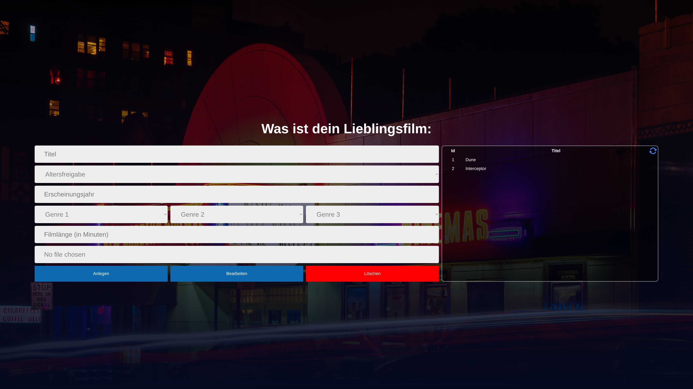

# 🎬 Film Database

A full-stack movie database application currently being modernized as part of my portfolio.

The goal of this project is not only to build a movie database but also to practice modern software engineering concepts such as containerization, CI/CD, cloud deployment, automated testing, and frontend migration.





## 🚀 Roadmap

- [x] Dockerize PHP backend
- [x] Dockerize MariaDB
- [x] Establish database connection
- [x] Build REST API
- [ ] Migrate frontend to React + TypeScript
- [ ] Add Playwright end-to-end tests
- [ ] Set up GitHub Actions
- [ ] Deploy backend to AWS EC2
- [ ] Deploy frontend to AWS S3
- [ ] Configure reverse proxy with Nginx

---

## 🛠 Tech Stack

### Backend

- PHP
- MariaDB
- REST API

### Frontend

- HTML
- CSS
- JavaScript

> Planned migration to React + TypeScript

### DevOps

- Docker
- Docker Compose

> Planned:
- GitHub Actions
- AWS
- Nginx

---

## 📂 Project Structure

```
filmdb/
├── backend/
├── frontend/
├── database/
├── docker-compose.yml
└── README.md
```

---

## ⚙️ Getting Started

1. Install Docker Desktop

    [Docker Installation Guide](https://docs.docker.com/engine/install/fedora/)

2. Clone the repository

    ```bash
    git clone <repository-url>
    ```

3. Start the application

    ```bash
    docker compose up --build
    ```

## 📱 Application

### The Frontend application will be available at:

```
Frontend: http://localhost:8080
```

### The Backend application will be available at:

```
http://localhost:8080
```

### The phpMyAdmin Dashboard will be available at:
```
http://localhost:8081
```

### To test the Database connection:

```
http://localhost:8080/db-test.php
```

---

## 🎯 Purpose

This project is part of my personal learning journey to gain hands-on experience with:

- Docker
- REST APIs
- React
- TypeScript
- CI/CD
- AWS
- Automated Testing
- Modern Full-Stack Architecture

---

## 📜 License

This project is for educational and portfolio purposes.
